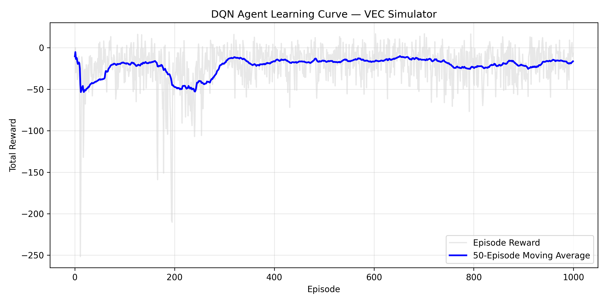
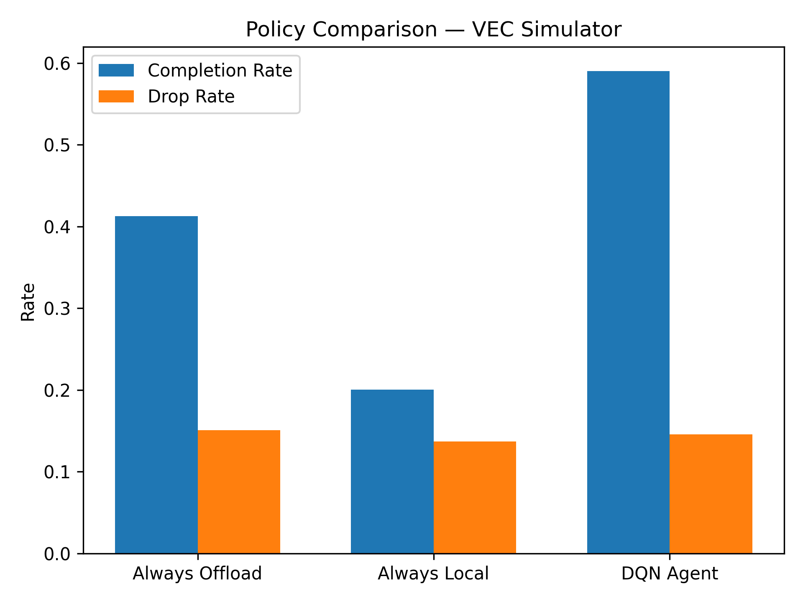

# VEC-DRL-Lab

**Vehicular Edge Computing Simulator with Deep Reinforcement Learning Scheduling**

A research simulator built from scratch for studying task offloading policies
in VEC environments. Accompanies the lab manual:
*VEC Research Laboratory — Module 1*.

---

## Author

**Dr. Habte Lejebo**
Research Areas: Vehicular Edge Computing · Fog Computing · Deep Reinforcement Learning

---

## Key Results

| Policy | Completion Rate | Drop Rate |
|---|---|---|
| Always Offload | 41.3% | 15.1% |
| Always Local | 20.0% | 13.7% |
| **DQN Agent** | **59.0%** | **14.6%** |

DQN outperforms the best baseline by **17.7 percentage points** through adaptive
balancing of local and edge resources (**67.9% edge / 32.1% local utilization**).

---

## System Model

Task arrivals follow a stochastic process with average rate λ = 1.5 tasks/step.
The system utilisation factor ρ = λ/μ ≈ 1.81, representing a moderately overloaded
system where intelligent scheduling provides significant advantage over fixed policies.

A classical M/M/1 scheduler is insufficient because:
- Two heterogeneous processors (vehicle CPU + edge RSU)
- Time-varying channel quality (distance-based SNR degradation)
- Non-stationary load (vehicle mobility in and out of coverage)

---

## What Is Modeled

| Component | Implementation |
|---|---|
| Vehicle mobility | 2D constant-velocity model |
| Wireless channel | Shannon capacity with distance-based SNR |
| Task generation | Stochastic arrival (Uniform[0,3] tasks/step) |
| Local execution | Vehicle CPU, capacity 150 cycles/step |
| Edge execution | RSU, capacity 300 cycles/step |
| Multi-server deployment | 3 RSUs with coverage zones |
| Server handover | Queue migration with backhaul delay |
| Backhaul link | Shared bandwidth, 10 Mbps |
| DRL agent | DQN with experience replay, ε-greedy |
| Reward design | Symmetric congestion-aware + outcome-based |

---
## Project Structure
VEC-DRL-Lab/
├── src/
│   └── vecsim/              # Core simulator package
│       ├── init.py
│       ├── task.py          # Task lifecycle model
│       ├── vehicle.py       # Vehicle mobility + local execution
│       ├── edge_server.py   # RSU processing + queuing + handover
│       ├── channel.py       # Shannon wireless channel model
│       └── agent.py         # DQN scheduling agent
├── experiments/
│   ├── simulation.py        # 1000-episode DRL training loop
│   ├── baseline_comparison.py  # Policy evaluation (3 policies)
│   └── plot.py              # Learning curve visualisation
├── results/
│   ├── comparison.png       # Baseline comparison chart
│   ├── learning_curve.png   # DQN learning curve
│   ├── trained_agent.npy    # Pre-trained agent weights
│   ├── episode_metrics.csv  # Per-episode training data
│   └── step_metrics.csv     # Per-step simulation data
├── docs/
│   └── VEC_Lab_Manual.pdf   # Lab manual Module 1
├── setup.py
├── CITATION.md
├── LICENSE
└── README.md

---

## Quick Start

```bash
git clone https://github.com/habteL/VEC-DRL-Lab.git
cd VEC-DRL-Lab
pip install -e .
```

**Train the DQN agent (1000 episodes):**
```bash
python experiments/simulation.py
```

**Evaluate against baselines:**
```bash
python experiments/baseline_comparison.py
```

**Plot the learning curve:**
```bash
python experiments/plot.py
```

---

## Requirements

- Python >= 3.8
- numpy >= 1.21
- matplotlib >= 3.4

All dependencies are installed automatically with `pip install -e .`

---

## Learning Curve

The DQN agent demonstrates convergent learning behavior over 1000 training episodes,
achieving a 185% improvement in cumulative reward from episode 0 to convergence,
with policy stabilization observed after approximately episode 600.



---

## Baseline Comparison



---

## Reward Engineering — Ablation Study

Three reward formulations were evaluated:

| Formulation | Completion Rate | Edge Util. | Local Util. | Outcome |
|---|---|---|---|---|
| Queue-length heuristic | 53.1% | ~70% | ~30% | Local bias |
| Workload penalty | 40.7% | 95.5% | 4.5% | Edge bias |
| **Symmetric congestion-aware** | **59.0%** | **67.9%** | **32.1%** | **Balanced** |

The symmetric reward teaches the agent to choose the less congested resource
rather than always preferring one side.

---

## Module Roadmap

| Module | Status | Content |
|---|---|---|
| Module 1 | ✅ Complete | Core simulator + DQN scheduling |
| Module 2 | 🔄 Planned | Multi-vehicle + Multi-Agent RL |
| Module 3 | 🔄 Planned | Deadline-aware scheduling |
| Module 4 | 🔄 Planned | Stochastic backhaul + Advanced DRL |

---

## Citation

If you use this repository in your research or teaching, please cite:

```bibtex
@misc{lejebo2026veclab,
  author = {Lejebo, Leka Habte},
  title  = {{VEC Research Laboratory: Building a Vehicular Edge
            Computing Simulator from Scratch}},
  year   = {2026},
  publisher = {GitHub},
  url    = {https://github.com/habteL/VEC-DRL-Lab}
}
```

See [CITATION.md](CITATION.md) for full citation details including
related published works in IEEE Network and IEEE Transactions on
Consumer Electronics.

---

## License

- **Source code** (`src/`, `experiments/`): [MIT License](LICENSE)
- **Documentation and lab manual** (`docs/`): [CC BY 4.0](LICENSE)

© 2026 Leka Habte Lejebo